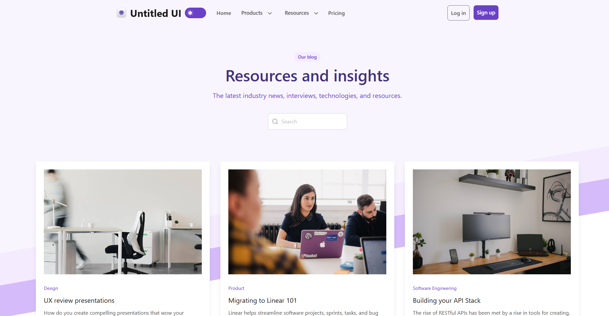

# Blog-SPA-React Учебный проект по макету Figma

## Ссылка на рабочий сайт развёрнутый через хостинг GitHubPages: [Посмотреть проект]()

### Untitled UI – FREE Figma UI kit and design system v2.0 - Дизайн разработан и предоставлен в бесплатный доступ автором Jordan Hughes @designer Melbourne, Australia 
* jordanhughes.co
* https://x.com/jordanphughes
* [Ссылка на профиль в Figma](https://www.figma.com/@designer)

***

## 🛠 Технологический стек

 


## Структура проекта

Основой является файл index.html. 
Два файла для настроек сборки package в формате json, tsconfig для настроек работы TypeScript и vite конфиг - это технические файлы. 

Главным файлом является main.tsx, в него подключается структура приложения App.tsx, которая содержит основу. 
Один файл стилей index.css, в котором описаны основные цвета и правила отрисовки.

Папка /public содержит все медиа файлы используемые в проекте.
В папке /src располагаются все элементы приложения.

```
src/
├── pages/                          ← целые страницы
│   ├── BlogDetailPage.tsx          страница блога
│   ├── LoginPage.tsx               форма логина
│   └── RegistrationPage.tsx        форма регистрации
│
├── layouts/                        ← "рамка" сайта
│   ├── Header.tsx                  основная навигация и шапка сайта
│   └── Footer.tsx                  "подвал" с доп. ссылками
│
├── components/                     ← переиспользуемый UI
│   ├── ui/                         кнопки, инпуты
│   │   ├── FormInput.tsx
│   │   ├── SwiperNavigation.tsx           
│   │   └── ButtonSpin.tsx          
│   ├── blog/                       ← элементы блогов
│   │   ├── BlogCard.tsx            карточка блога
│   │   └── BlogCatalog.tsx         каталог карточек
│   │   
│   └── navigation/                 ← элементы для навигации
│       ├── BurgerMenu.tsx
│       └── DropdownMenu.tsx
│
├── sections/                       ← крупные блоки для страницы
│   ├── HeaderTitle.tsx             только для главной
│   ├── AdditionalContent.tsx
│   ├── AnotherBlogsDemo.tsx
│   ├── LinksBlog.tsx
│   ├── OtherBlogs.tsx
│   └── SendNewsLetter.tsx
│
├── hooks/
│   └── useForm.tsx                 ← хук для обработки формы
│
├── context/
│   └── AuthContext.tsx             ← контекст для работы с localStorage
│
├── api/
│   └── auth.ts                     ← имитация работы сервера
│
├── features/                       ← логические блоки
│   ├── ThemeToogle.tsx             переключение тёмной/светлой темы сайта
│   └── validation.ts               валидация
│
├── types/                          ← типы данных
├── data/                           ← массивы исходных данных mockData, navigation
├── utils/                          ← вспомогательные утилиты
│   └── scrollToTop.tsx             для работы с библиотекой Lenis
│
├── App.tsx
├── main.tsx
└── index.css
```

## Основные возможности

* Можно просматривать содержимое блогов в каталоге без полной перезагрузки страницы

* Есть переключение на тёмную тему интерфейса

* Живой поиск позволяет находить нужные посты по ключевым словам

* Формы имеют кастомную валидацию

* Имитация ответа от сервера реализованная через всплывающие уведомления вверху у экрана (Тосты)

* В случае ошибок связанных с отсутствием поста по ключевым словам поиска или по неверно переданному id в адресной строке, пользователь увидит текст с уведомлением об ошибке

* Lazy-loading для страниц сайта

* Сохранение пользователя и настроек в localStorage

## Скриншот главной страницы блога


## Как запустить локально

1. **Клонируйте репозиторий:** 
    ```
    git clone https://github.com/AncientSteal/
    ```

2. **Установить зависимости:**
   (Эта команда создаст папку `node_modules` и скачает туда Tailwind и библиотеки Lenis + Swiper)
   ```bash
   npm install
   ```

3. **Запустить проект в режиме разработки:**
   ```bash
   npm run dev
   ```

## Об авторе
**Артур** — начинающий Frontend-разработчик.
Этот проект — мой шаг к освоению React и TypeScript.

### Мои планы по обучению
- Глубокое изучение **React** для создания масштабируемых приложений.
- Освоение анимаций с помощью **GSAP** (хочу оживлять интерфейсы!).
- Изучение **Docker** для понимания процессов деплоя и контейнеризации.

### 📫 Связь со мной:

[](https://vk.com/oracleelder)
[](bezlepkin_artur@mail.ru)


